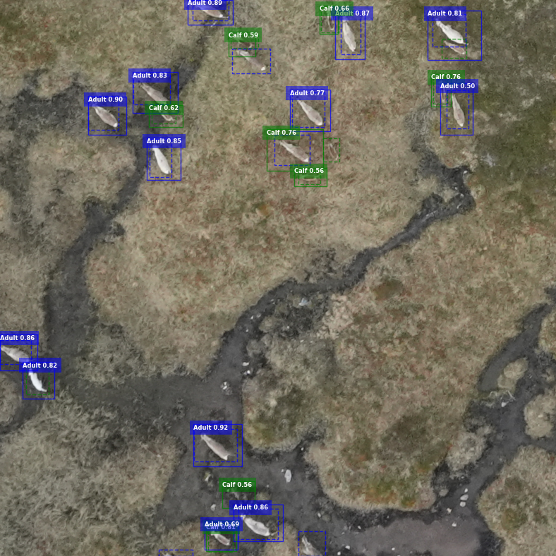
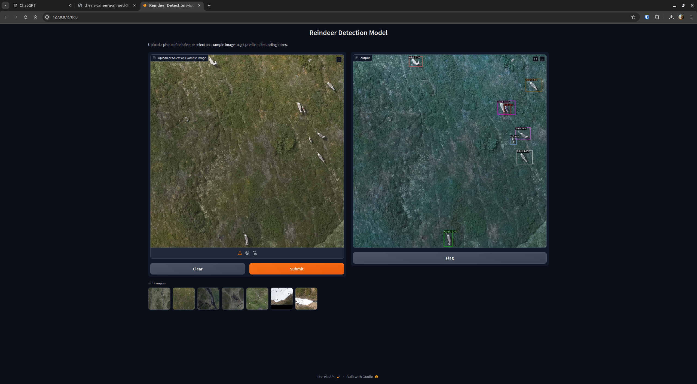

# Reindeer detection on satellite imagery

This repository contained code for training and using a model for detecting reindeer on satellite images. The repository is currently a **WORK IN PROGRESS**.

## Installation

In this repository we are using [detectron2](https://github.com/facebookresearch/detectron2). To install it follow the procedure:

- Install `poetry` by running:

```bash
pipx install poetry
```

Install the required packages

```bash
poetry install
```

## Import data from LabelStudio

We are using [LabelStudio] to annotate the images. After annonating the images in LabelStudio you can **export** annotations and images as `COCO` format and you should get a `.zip` file. Extract the `.zip` in a folder `./data/annotations`.

Then, follow the pipeline!

## Set up `config.yaml`

In the file `config.example.yaml` one can see the different configs available for all scripts. This is mainly used for path management, but some other parameters can also be set, which will be referred to later.

### Configuration Values

Below is a detailed description of all the configuration values in the provided config file.

#### Path management

- **`ANNOTATION_PATH`**:  
  Path to the annotation file for the non-tiled test dataset.  
  Example: `/home/taheera.ahmed/data/reindeerdrone/whole/test/result.json`

- **`IMAGES_FOLDER_PATH`**:  
  Path to the directory containing the non-tiled test images.  
  Example: `/home/taheera.ahmed/data/reindeerdrone/whole/test`

- **`TILE_ANNOTATION_PATH`**:  
  Path to the annotation file for the tiled training dataset.  
  Example: `/home/taheera.ahmed/data/reindeerdrone/tiles/train/new_annotations.json`

- **`TILE_FOLDER_PATH`**:  
  Path to the directory containing the tiled training images.  
  Example: `/home/taheera.ahmed/data/reindeerdrone/tiles/train/images`

- **`TILE_TEST_ANNOTATION_PATH`**:  
  Path to the annotation file for the tiled test dataset.  
  Example: `/home/taheera.ahmed/data/reindeerdrone/tiles/test/new_annotations.json`

- **`TILE_TEST_FOLDER_PATH`**:  
  Path to the directory containing the tiled test images.  
  Example: `/home/taheera.ahmed/data/reindeerdrone/tiles/test`

- **`OUTPUT_FOLDER`**:  
  Path to the directory where output files, such as intermediate data and results, will be saved.  
  Example: `/home/taheera.ahmed/code/reindeerdrone/output/02_hyperparam_opt`

#### Data processing (`dataset.py`)

- **`TILE_SIZE`**:  
  The size of the tiles (in pixels) that images will be divided into.  
  Default: `1024`

- **`OVERLAP`**:  
  The number of pixels by which tiles overlap.  
  Default: `100`

- **`PLOT_ANNOTATION`**:  
  A boolean flag indicating whether to plot the annotations during data processing.  
  Default: `False`

#### Training (`train.py`)

- **`OPTUNA_TRIALS`**:  
  The number of trials to run for hyperparameter optimization using Optuna.  
  Example: `20`

#### Evaluation (`evaluation.py`)

- **`STORE_EVALUATION_RESULTS`**:  
  A boolean flag indicating whether evaluation results should be stored in a file.  
  Default: `True`

- **`EVALUATION_OUTPUT_FILE`**:  
  Path to the file where evaluation metrics will be stored.  
  Example: `/home/taheera.ahmed/code/reindeerdrone/output/evaluation_metrics.json`

#### Predictions (`predict.py`)

- **`CONFIG_FILE`**:  
  The path to the Detectron2 model configuration file used for making predictions.  
  Example: `COCO-Detection/faster_rcnn_R_50_FPN_3x.yaml`

- **`MODEL_WEIGHTS`**:  
  Path to the trained model weights that will be used for making predictions.  
  Example: `/home/taheera.ahmed/code/reindeerdrone/output/02_hyperparam_opt/model_final.pth`

- **`USE_FILTER`**:  
  A boolean flag indicating whether to apply a filter to remove duplicate bounding boxes from predictions.  
  Default: `True`

- **`PLOT_PREDICTION`**:  
  A boolean flag indicating whether to save images of the predictions alongside ground truth bounding boxes.  
  Default: `True`

## Create the training dataset dataset

```bash
poetry run src/dataset.py
```

Because the satellite images are too big to be processed efficiently by `detectron2` we split the images into `tiles`. **Tile size** can be changed in the `config.yaml` file and can slighlty change the results (we recommand to do a `hyperparameter search` to search for the optimal tile size).

The script will create a `tiles` folder containing the tiles of the processed satellite images. The path to the processed satellite images that are to be processed should be updated in the `config.yaml` file.

## Train detectron2

```bash
poetry run src/train.py
```

With this script we train a `Detectron2` model with a [faster-rcnn architecture](https://github.com/facebookresearch/detectron2/blob/main/configs/COCO-Detection/fast_rcnn_R_50_FPN_1x.yaml) as backbone. Note that it is possible to change the backbone by choosing another [Detectron compliant](https://github.com/facebookresearch/detectron2/tree/main/configs/COCO-Detection) model.

The script should create a folder `output` that contains `model_final.pth`, the logs and other files that `Detectron2` creates.

## Evaluate the trained model

```bash
poetry run src/evaluate.py
```

This script will use the trained model and run evaluation on the model by using the test set. The test set should be tiled as well using the ``dataset.py`` script mentioned earlier.
It is possible to set `STORE_EVALUATION_RESULTS` which will store a JSON-file with the final evaluation metrics from the test set.

## Predict with the trained model

```bash
poetry run src/predict.py
```

The script will load the model that has been trained. The script will create a folder inside the `OUTPUT_FOLDER` defined in `config.yaml`: `/predict/image` containing the predicted bounding boxes and `./predict/json` containing the a `.json` file per image documenting all the bounding box coordinates.

In the `config.yaml` file you can choose to plot the predictions (parameter `TRUE / FALSE`). If `TRUE` plots of the satellite pictures with annotations should be created in `predict/image/`. You can also set the `USE_FILTER` parameter `TRUE / FALSE` if you want to remove duplicate bounding boxes from the predictions.

An example of the visualizations can be seen in the picture underneath. The dashed lines shows ground truth and the annotated bounding boxes. The lines shows the predicted bounding box along with the predicted label and its probability.



```bash
poetry run src/app.py
```

This script will run a Gradio application based on the model weights in the config and some example images which is in the `assets/gradio_example_images`. It is also possible to upload your own photos.
A screenshot of the application can be found underneath.

