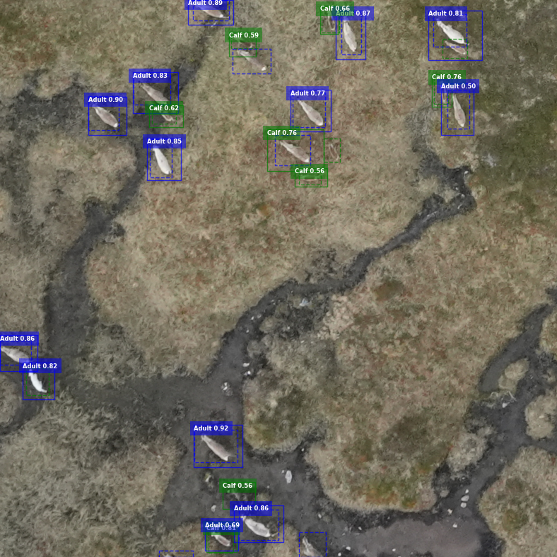

# Reindeer detection on satellite imagery

This repository contained code for training and using a model for detecting reindeer on satellite images. The repository is currently a **WORK IN PROGRESS**.

## Installation

In this repository we are using [detectron2](https://github.com/facebookresearch/detectron2). To install it follow the procedure:

- Create a virtual environment:

```bash
python3 -m venv .venv
source .venv/bin/activate
```

- Install detectron2 and the other dependancies:

```
# FIX for installing detectron2, see: https://github.com/Dao-AILab/flash-attention/issues/253
FLASH_ATTENTION_SKIP_CUDA_BUILD=TRUE pip install flash-attn --no-build-isolation 

# Install dependancies
git clone https://github.com/facebookresearch/detectron2.git
pip install -e detectron2
pip install -r requirements.txt
```


- Activate the virtual environment

```bash
source .venv/bin/activate
```

## Import data from LabelStudio

We are using [LabelStudio] to annotate the images. After annonating the images in LabelStudio you can **export** annotations and images as `COCO` format and you should get a `.zip` file. Extract the `.zip` in a folder `./data/annotations`.

Then, follow the pipeline!

## Set up config.yaml

In the file `example.config.yaml` one can see the different configs available for all scripts. This is mainly used for path management, but some other parameters can also be set, which will be referred to later.

## Create the training dataset dataset

```bash
python3 src/dataset.py
```

Because the satellite images are too big to be processed efficiently by `detectron2` we split the images into `tiles`. **Tile size** can be changed in the `config.yaml` file and can slighlty change the results (we recommand to do a `hyperparameter search` to search for the optimal tile size).

The script will create a `tiles` folder containing the tiles of the processed satellite images. The path to the processed satellite images that are to be processed should be updated in the `config.yaml` file.

## Train detectron2

```bash
python3 src/train.py
```

With this script we train a `Detectron2` model with a [faster-rcnn architecture](https://github.com/facebookresearch/detectron2/blob/main/configs/COCO-Detection/fast_rcnn_R_50_FPN_1x.yaml) as backbone. Note that it is possible to change the backbone by choosing another [Detectron compliant](https://github.com/facebookresearch/detectron2/tree/main/configs/COCO-Detection) model.

The script should create a folder `output` that contains `model_final.pth`, the logs and other files that `Detectron2` creates.

## Evaluate the trained model

```bash
python3 src/evaluate.py
```

This script will use the trained model and run evaluation on the model by using the test set. The test set should be tiled as well using the ``dataset.py`` script mentioned earlier.

## Predict the trained model

```bash
python3 src/predict.py
```

The script will load the model that has been trained. The script will create a folder inside the `OUTPUT_FOLDER` defined in `config.yaml`: `/predict/image` containing the predicted bounding boxes and `./predict/json` containing the a `.json` file per image documenting all the bounding box coordinates.

In the `config.yaml` file you can choose to plot the predictions (parameter `TRUE / FALSE`). If `TRUE` plots of the satellite pictures with annotations should be created in `predict/image/`. You can also set the `USE_FILTER` parameter `TRUE / FALSE` if you want to remove duplicate bounding boxes from the predictions.

An example of the visualizations can be seen in the picture underneath. The dashed lines shows ground truth and the annotated bounding boxes. The lines shows the predicted bounding box along with the predicted label and its probability.


