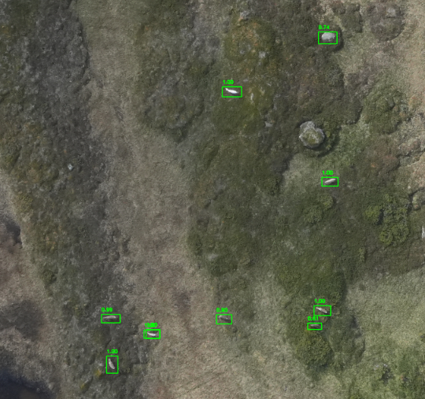

# Reindeer detection on satellite imagery

This repository contained code for training and using a model for detecting reindeer on satellite images. The repository is currently a **WORK IN PROGRESS**.

## Installation

In this repository we are using [detectron2](https://github.com/facebookresearch/detectron2). To install it follow the procedure:

- Create a virtual environment:

```bash
python3 -m venv .venv
source .venv/bin/activate
```

- Install detectron2 and the other dependancies:

```
# FIX for installing detectron2, see: https://github.com/Dao-AILab/flash-attention/issues/253
FLASH_ATTENTION_SKIP_CUDA_BUILD=TRUE pip install flash-attn --no-build-isolation 

# Install dependancies
git clone https://github.com/facebookresearch/detectron2.git
pip install -e detectron2
pip install -r requirements.txt
```


- Activate the virtual environment

```bash
source .venv/bin/activate
```

## Import from LabelStudio

We are using [LabelStudio] to annotate the images. After annonating the images in LabelStudio you can **export** annotations and images as a `.zip` file and extract it in a folder `./data/annotations`.

Then, follow the pipeline!

## Create the training dataset dataset

```bash
python3 dataset.py
```
This will create a `tiles` folder containing the tiles of the processed satellite images. The path to the processed satellite images that are to be processed should be updated in the `config.yaml` file.

## Train detectron2

```bash
python3 train.py
```

The script should create a folder `output` that contains `model_final.pth`, the logs and other files that `Detectron2` creates.

## Predict

```bash
python3 predict.py
```

The script will load the model that has been trained in the previous step to make the predictions. The script will create a folder `./predict/image` containing the predicted bounding boxes and `./predict/json` containing the a `.json` file per image documenting all the bounding box coordinates.

In the `config.yaml` file you can choose to plot the predictions (parameter `TRUE / FALSE`). If `TRUE` plots of the satellite pictures with annotations should be created in `predict/image/`.




